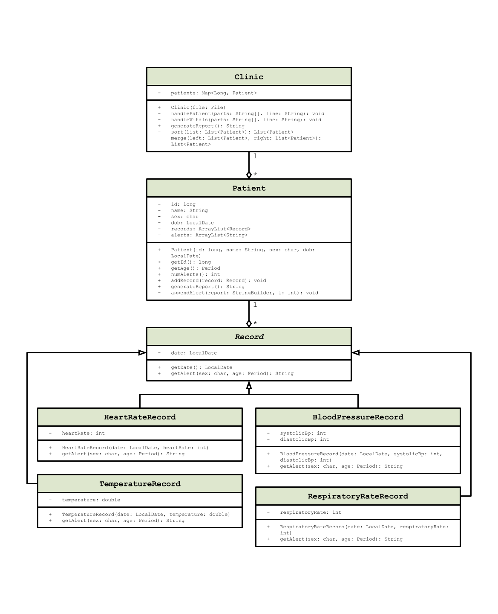

# Clinic Patient Vitals Monitoring System

This Java program processes raw vitals data from patients (including heart rate, blood pressure, temperature, and respiratory rate) and identifies any measurements outside of normal medical ranges for their age and sex. It generates a report listing patients sorted by the number of abnormal readings, allowing clinicians to prioritize follow-up care.

## UML Diagram

## Input Format

The input file must be a plain text file named `input.txt` with the following structure:

### Patient Registrations

`PATIENT,<ID>,<Name>,<Sex (M or F)>,<Date of Birth (YYYY-MM-DD)>`

**Example:**

`PATIENT,5043287119,Ming Zhao,M,1971-07-25`

### Vitals Records

`VITALS,<ID>,<Date (YYYY-MM-DD)>,<Heart Rate>,<Systolic/Diastolic Blood Pressure>,<Temperature (in celsius)>,<Respiratory Rate>`

**Example:**

`VITALS,5043287119,2025-01-08,112,140/95,37.5,17`

## Output Format

The program generates a plain text file named `output.txt` listing patients sorted in descending order by the number of abnormal measurements.

`Patient: <Name> (<ID>)
Sex: <Sex (M or F)>
Age: <Age> (<Date of Birth (YYYY-MM-DD)>)

-- Alerts --
<Date> [<Vital Sign>] <Alert Description> (<Measured Value>)`

If the patient has no alerts:

`-- Alerts --
No alerts.`

**Example:**

`Patient: Priya Patel (1886631594)
Sex: F
Age: 36 (1988-11-03)

-- Alerts --
2024-03-14 [Heart Rate] Bradycardia (42 bpm)
2024-03-14 [Blood Pressure] Possible hypotension (85/55 mmHg)
2025-01-06 [Temperature] Moderate fever (38.5 °C)`

## Possible Extensions
- Add support for additional vitals like oxygen saturation
- Introduce patient risk scoring based on vital signs

## Author
Developed by @fwury for ICS4UN
